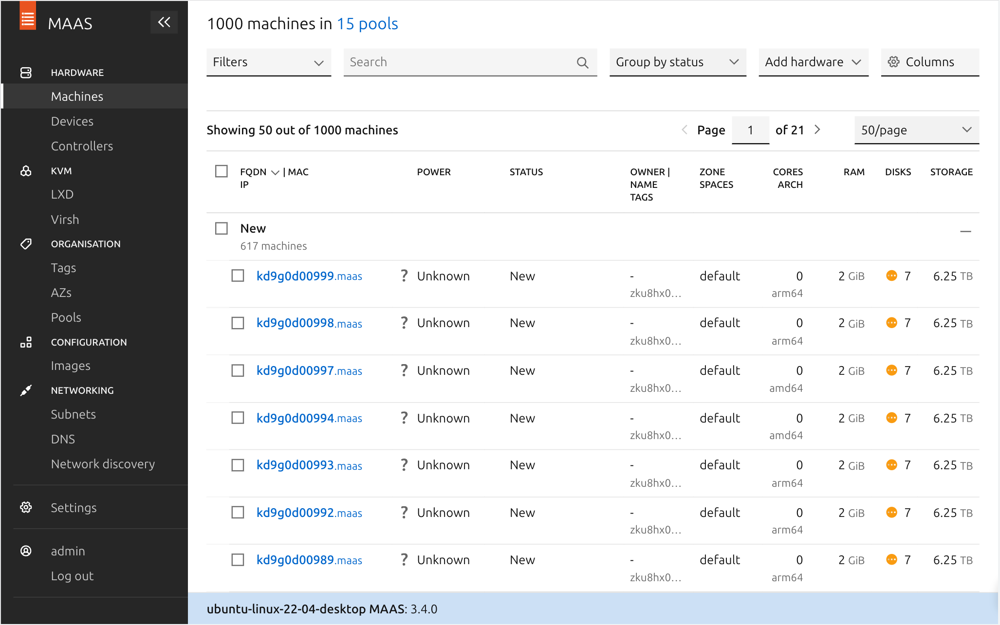
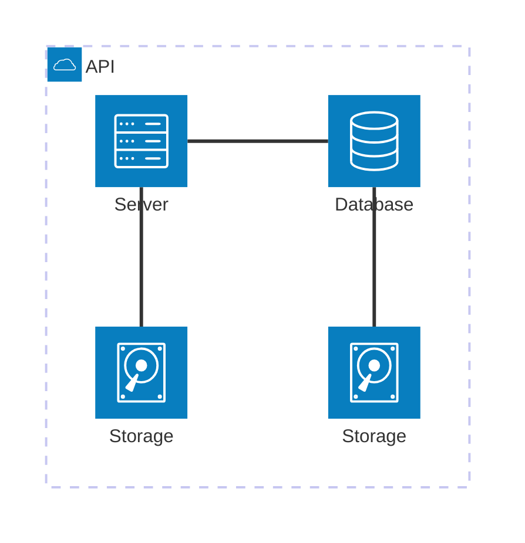

# Roteiro — Árvore de Decisão: Consumo de Gadgets e e-waste

## Objetivo

O objetivo deste roteiro é aplicar **aprendizado supervisionado (Decision Tree)** para classificar países e anos como “Verdes” ou “Sujos”, de acordo com o comportamento entre **gastos com gadgets** e **geração de e-waste**.

Documentar cada etapa (EDA → Pré-processamento → Split → Treino → Avaliação → Conclusão) com **evidências** (gráficos e métricas).

## Montagem do Roteiro

Os pontos "tarefas" são os passos que devem ser seguidos para a realização do roteiro. Eles devem ser claros e objetivos. Com evidências claras de que foram realizados.

### Etapa 1: Exploração dos Dados

- Estatísticas descritivas, tipos, nulos.
- Visualizações principais.
- Evidências:
  - 
  - 

/// caption
Dashboard do MAAS
///

Conforme ilustrado acima, a tela inicial do MAAS apresenta um dashboard com informações sobre o estado atual dos servidores gerenciados. O dashboard é composto por diversos painéis, cada um exibindo informações sobre um aspecto específico do ambiente gerenciado. Os painéis podem ser configurados e personalizados de acordo com as necessidades do usuário.

### Etapa 2: Pré-processamento
- Limpeza, imputação, criação do rótulo (1=Verde, 0=Sujo), normalização quando necessário.
- Evidências: descrição do pipeline e contagens pós-limpeza.

## App

### Etapa 3: Divisão dos Dados

Split treino/teste com `random_state` e `stratify` (se aplicável).
- Evidências: tamanhos dos conjuntos.

### Etapa 4:Treinamento do Modelo

- `DecisionTreeClassifier` com hiperparâmetros informados.
- Evidência: 

### Etapa 5: Avaliação do Modelo
- Métricas: accuracy, precision, recall, f1, ROC-AUC, matriz de confusão.
- Evidências:
  - 
  - 

 import os, matplotlib.pyplot as plt
IMG_DIR = os.path.join(os.path.dirname(__file__), "img")
os.makedirs(IMG_DIR, exist_ok=True)

# exemplo de salvamento (substitua plt.show()):
plt.tight_layout(); plt.savefig(os.path.join(IMG_DIR, "arvore_decisao.png"), dpi=200); plt.close()
# repita com nomes: target.png, heatmap.png, roc.png, confusion.png 

Exemplo de diagrama

[Mermaid](https://mermaid.js.org/syntax/architecture.html){:target="_blank"}

## Questionário, Projeto ou Plano

Esse seção deve ser preenchida apenas se houver demanda do roteiro.

## Discussões

Quais as dificuldades encontradas? O que foi mais fácil? O que foi mais difícil?

## Conclusão

O que foi possível concluir com a realização do roteiro?
